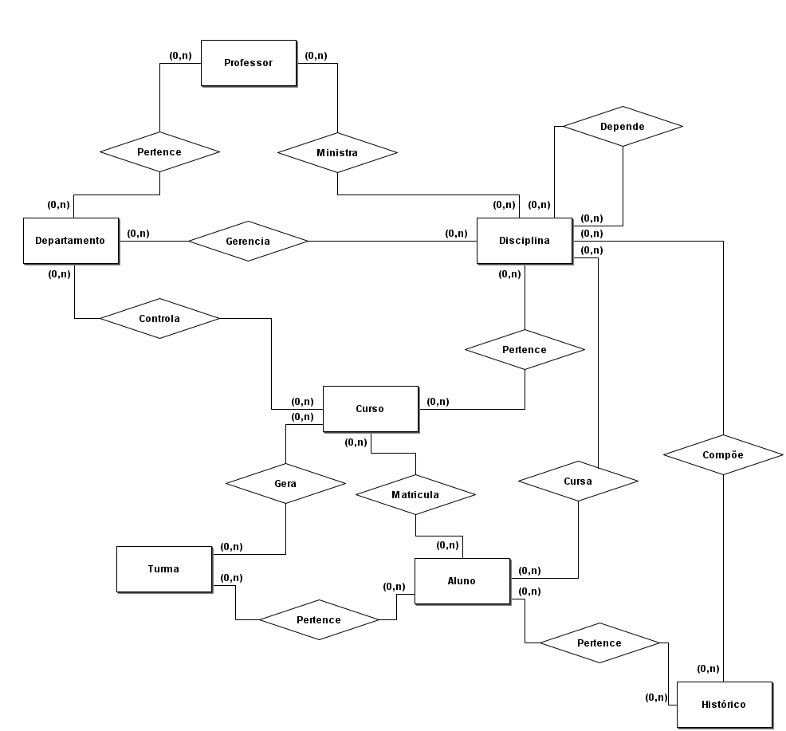
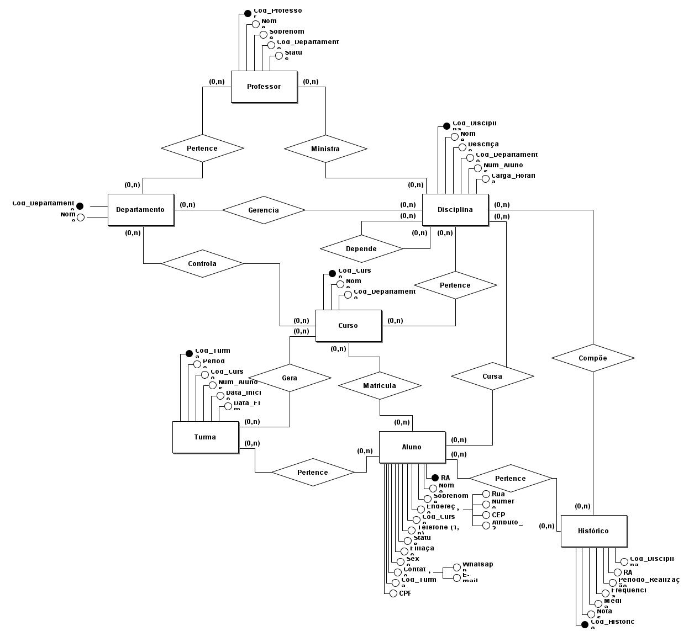
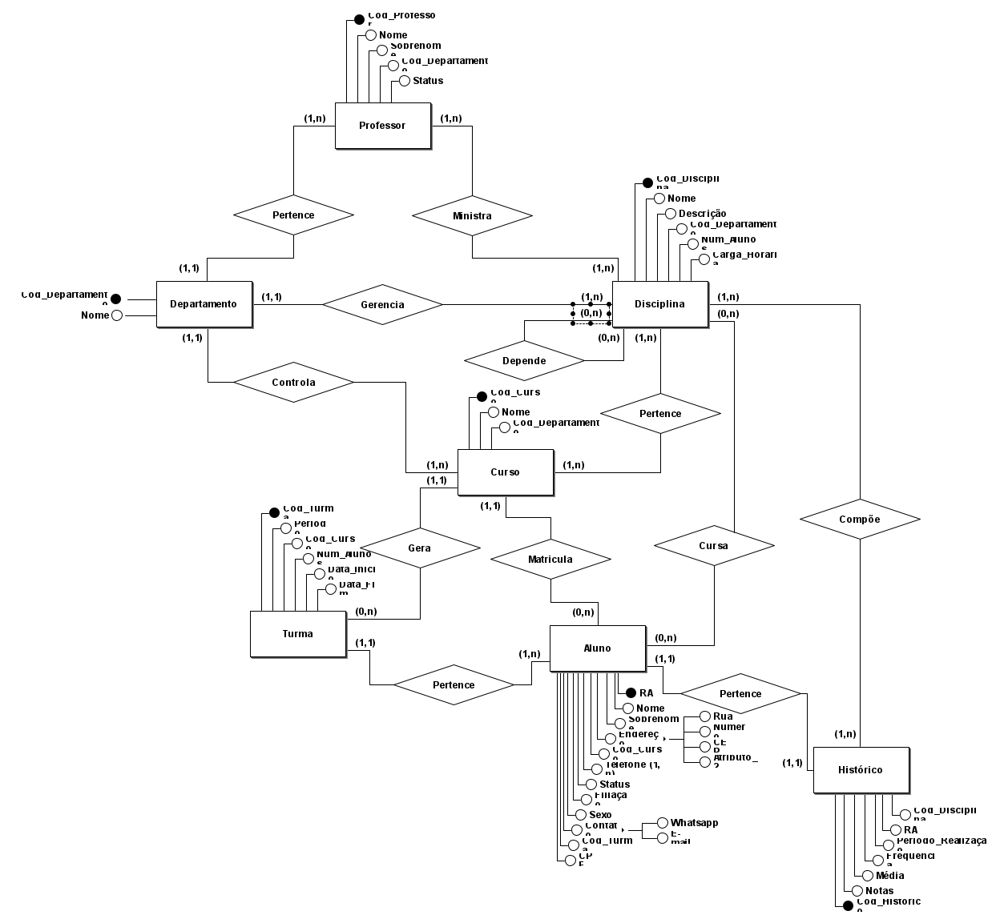
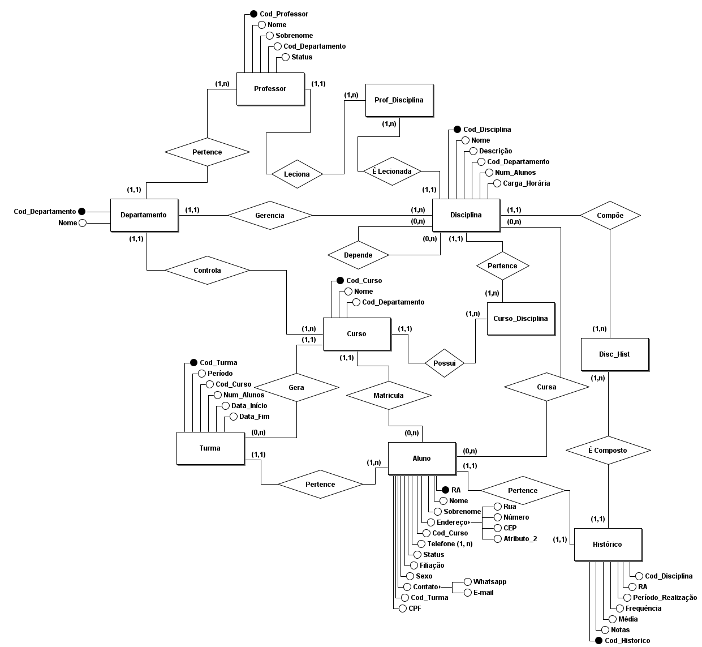
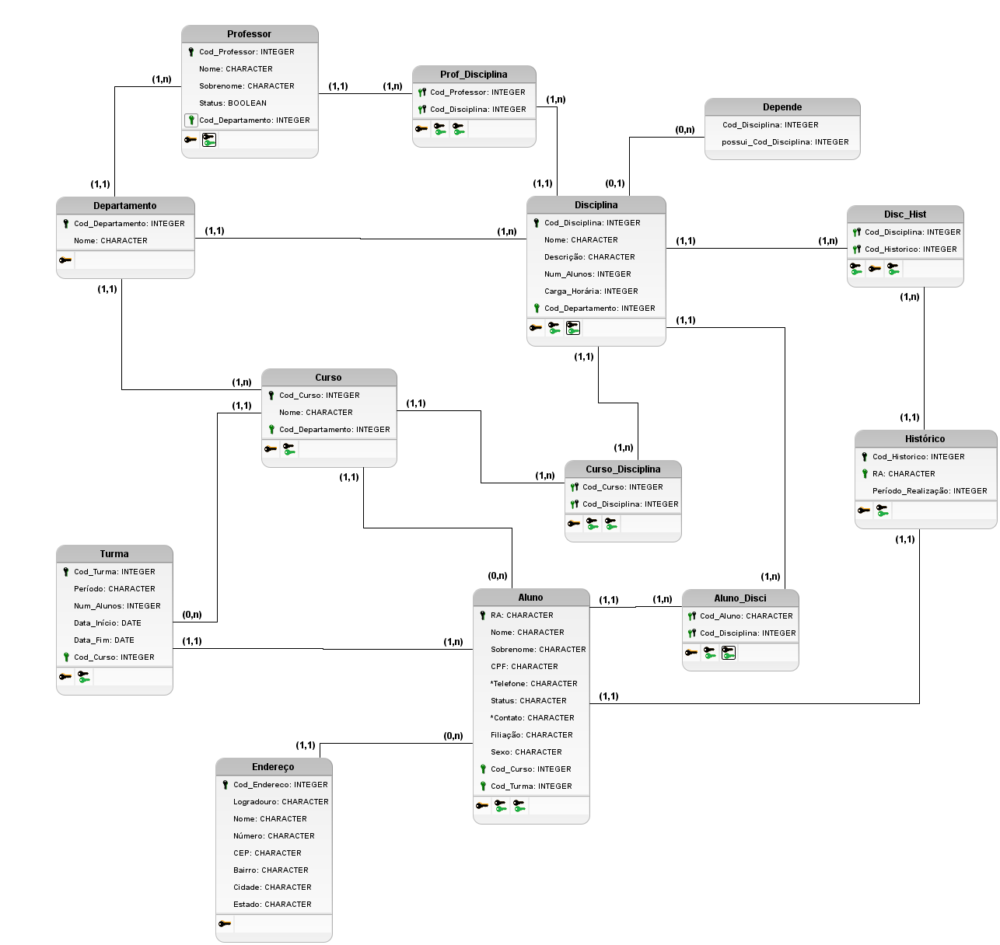

# Estudos Banco de Dados
## **Fonte de Estudos: [Bóson Treinamentos](https://www.youtube.com/playlist?list=PLucm8g_ezqNoNHU8tjVeHmRGBFnjDIlxD)**
### **Tecnologias usadas**
- [brModelo v3.31](http://www.sis4.com/brModelo/index.html) - ferramenta para criação da modelagem do BD, tanto conceitual quanto relacional.

## **Banco de dados para gerenciamento de uma faculdade** 
- controle centralizado de alunos, professores, cursos, disciplinas, histórico escolar e turmas

## **Aula 00 - Criação das entidades** 

## **Aula 01 - Alocando atributos** 

## **Aula 02 - Determinando cardinalidade** 

## **Aula 03 - Eliminando relacionamentos muitos para muitos** 
### **Modelo Conceitual:**

## **Aula 04 - Dicionário de Dados: Atributos** 
**NOTA: Atributos com \* podem ser transformados em entidades**
## **Entidade Professor**
| Atributo | Tipo de dado | Comprimento | Restrições | Descrição |
| - | - | - | - | - |
| <ins>Cod_Professor</ins> | Inteiro | 4 bytes | PK, NOT NULL | Código de identificação do professor |
| Nome | Caractere | 40 bytes | NOT NULL | Nome do professor |
| Sobrenome | Caractere | 40 bytes | NOT NULL | Sobrenome do professor |
| Status | Booleano | 1 bit | NOT NULL | Estado do professor (lecionando/não lecionando) |
| Cod_Departamento | Inteiro | 4 bytes | FK, NOT NULL | Código de identificação do departamento |

## **Entidade Departamento**
| Atributo | Tipo de dado | Comprimento | Restrições | Descrição |
| - | - | - | - | - |
| <ins>Cod_Departamento</ins> | Inteiro | 4 bytes | PK, NOT NULL | Código de identificação do departamento |
| Nome | Caractere | 40 bytes | NOT NULL | Nome do departamento |

## **Entidade Curso**
| Atributo | Tipo de dado | Comprimento | Restrições | Descrição |
| - | - | - | - | - |
| <ins>Cod_Curso</ins> | Inteiro | 4 bytes | PK, NOT NULL | Código de identificação do curso |
| Nome | Caractere | 40 bytes | NOT NULL | Nome do curso |
| Cod_Departamento | Inteiro | 4 bytes | FK, NOT NULL | Código de identificação do curso |

## **Entidade Aluno**
| Atributo | Tipo de dado | Comprimento | Restrições | Descrição |
| - | - | - | - | - |
| <ins>RA</ins> | Caractere | 8 bytes | PK, NOT NULL | Código de identificação do aluno |
| Nome | Caractere | 25 bytes | NOT NULL | Nome do aluno |
| Sobrenome | Caractere | 40 bytes | NOT NULL | Sobrenome do aluno |
| CPF | Caractere | 40 bytes | NOT NULL | CPF do aluno |
| *Telefone | Caractere | 40 bytes | NOT NULL | Telefones do aluno |
| Status | Caractere | 1 byte | NOT NULL | Estado da matrícula do aluno |
| *Contato | Caractere | 40 bytes | NOT NULL | Forma de contato com o aluno |
| Filiação | Caractere | 80 bytes | NOT NULL | Nome da mãe do aluno |
| Sexo | Caractere | 1 byte | NOT NULL | Sexo do aluno |
| Cod_Curso | Inteiro | 4 bytes | FK, NOT NULL | Código de identificação do departamento |
| Cod_Turma | Inteiro | 4 bytes | FK, NOT NULL | Código de identificação do departamento |

## **Entidade Endereço**
| Atributo | Tipo de dado | Comprimento | Restrições | Descrição |
| - | - | - | - | - |
| <ins>Cod_Endereco</ins> | Inteiro | 4 bytes | PK, NOT NULL | Código de identificação do endereço |
| Logradouro | Caractere | 40 bytes | NOT NULL | Rua, avenida, alameda, viela, etc. |
| Nome | Caractere | 80 bytes | NOT NULL | Nome do endereço do aluno |
| Número | Caractere | 10 byte | NOT NULL | Número da casa do aluno |
| CEP | Caractere | 10 byte | NOT NULL | CEP do endereço do aluno |
| Bairro | Caractere | 40 bytes | NOT NULL | Bairro onde o aluno reside |
| Cidade | Caractere | 40 bytes | NOT NULL | Cidade onde o aluno reside |
| Estado | Caractere | 40 bytes | NOT NULL | Estado onde o aluno reside |

## **Entidade Disciplina**
| Atributo | Tipo de dado | Comprimento | Restrições | Descrição |
| - | - | - | - | - |
| <ins>Cod_Disciplina</ins> | Inteiro | 4 bytes | PK, NOT NULL | Código de identificação da disciplina |
| Nome | Caractere | 30 bytes | NOT NULL | Nome da disciplina |
| Descrição | Caractere | 200 bytes | NULL | Descrição da disciplina |
| Num_Alunos | Inteiro | 4 bytes | NOT NULL | Número de alunos na disciplina |
| Carga_Horária  | Inteiro | 4 bytes | NOT NULL | Carga horária total da disciplina |
| Cod_Departamento | Inteiro | 4 bytes | FK, NOT NULL | Código do departamento responsável pela disciplina |

## **Entidade Turma**
| Atributo | Tipo de dado | Comprimento | Restrições | Descrição |
| - | - | - | - | - |
| <ins>Cod_Turma</ins> | Inteiro | 4 bytes | PK, NOT NULL | Código de identificação do turma |
| Período | Caractere | 20 bytes | NOT NULL | Período da turma (manhã, tarde ou noite) |
| Num_Alunos | Inteiro | 4 bytes | NOT NULL | Número de alunos matriculados na turma |
| Data_Início | Data | 4 bytes | NOT NULL | Data de início da turma |
| Data_Fim | Data | 4 bytes | NOT NULL | Data de fim da turma |
| Cod_Curso | Inteiro | 4 bytes | FK, NOT NULL | Código de identificação do curso |

## **Entidade Histórico**
| Atributo | Tipo de dado | Comprimento | Restrições | Descrição |
| - | - | - | - | - |
| <ins>Cod_Historico</ins> | Inteiro | 4 bytes | PK, NOT NULL | Código de identificação do histórico |
| RA | Caractere | 8 bytes | FK, NOT NULL | Código de identificação do aluno |
| Período_Realização | Inteiro | 4 bytes | NOT NULL | Duração de realização da disciplina (em meses) |

# **Entidades Associativas**

## **Entidade Disc_Hist**
| Atributo | Tipo de dado | Comprimento | Restrições | Descrição |
| - | - | - | - | - |
| <ins>Cod_Historico</ins> | Inteiro | 4 bytes | PK, FK, NOT NULL | Código de identificação do histórico |
| <ins>Cod_Disciplina</ins> | Inteiro | 4 bytes | PK, FK, NOT NULL | Código de identificação da disciplina |
| Nota | Decimal | 8 bytes | NOT NULL | Nota da disciplina |
| Frequência | Inteiro | 4 bytes | NOT NULL | Número de faltas na disciplina |

## **Entidade Curso_Disciplina**
| Atributo | Tipo de dado | Comprimento | Restrições | Descrição |
| - | - | - | - | - |
| <ins>Cod_Curso</ins> | Inteiro | 4 bytes | PK, FK, NOT NULL | Código de identificação do curso |
| <ins>Cod_Disciplina</ins> | Inteiro | 4 bytes | PK, FK, NOT NULL | Código de identificação da disciplina |

## **Entidade Prof_Disciplina**
| Atributo | Tipo de dado | Comprimento | Restrições | Descrição |
| - | - | - | - | - |
| <ins>Cod_Professor</ins> | Inteiro | 4 bytes | PK, FK, NOT NULL | Código de identificação do professor |
| <ins>Cod_Disciplina</ins> | Inteiro | 4 bytes | PK, FK, NOT NULL | Código de identificação da disciplina |

## **Entidade Aluno_Disci**
| Atributo | Tipo de dado | Comprimento | Restrições | Descrição |
| - | - | - | - | - |
| <ins>Cod_Aluno</ins> | Caractere | 8 bytes | PK, NOT NULL | Código de identificação do aluno (RA) |
| <ins>Cod_Disciplina</ins> | Inteiro | 4 bytes | PK, FK, NOT NULL | Código de identificação da disciplina |

## **Aula 05 - Derivando modelo lógico** 
### **Modelo Lógico:**

## **Entidades** 
### **Professor** 
#### **Atributos:** 
- <ins>Cod_Professor</ins>
- Nome
- Sobrenome
- Cod_Departamento
- Status
### **Departamento** 
#### **Atributos:** 
- <ins>Cod_Departamento</ins>
- Nome
### **Curso** 
#### **Atributos:** 
- <ins>Cod_Curso</ins>
- Nome
- Cod_Departamento
### **Aluno** 
#### **Atributos:** 
- <ins>RA</ins>
- Nome
- Sobrenome
- Endereço
- Cod_Curso
- *Telefone
- Status
- Filiação
- Sexo
- *Contato
- Cod_Turma
- CPF
### **Disciplina** 
#### **Atributos:** 
- <ins>Cod_Disciplina</ins>
- Nome
- Descrição
- Cod_Departamento
- Num_Alunos
- Carga_Horária 
### **Turma** 
#### **Atributos:** 
- <ins>Cod_Turma</ins>
- Período
- Cod_Curso
- Num_Alunos
- Data_Início
- Data_Fim
### **Histórico** 
#### **Atributos:** 
- <ins>Cod_Historico</ins>
- Notas
- Média
- Frequência
- Período_Realização
- RA
- Cod_Disciplina

