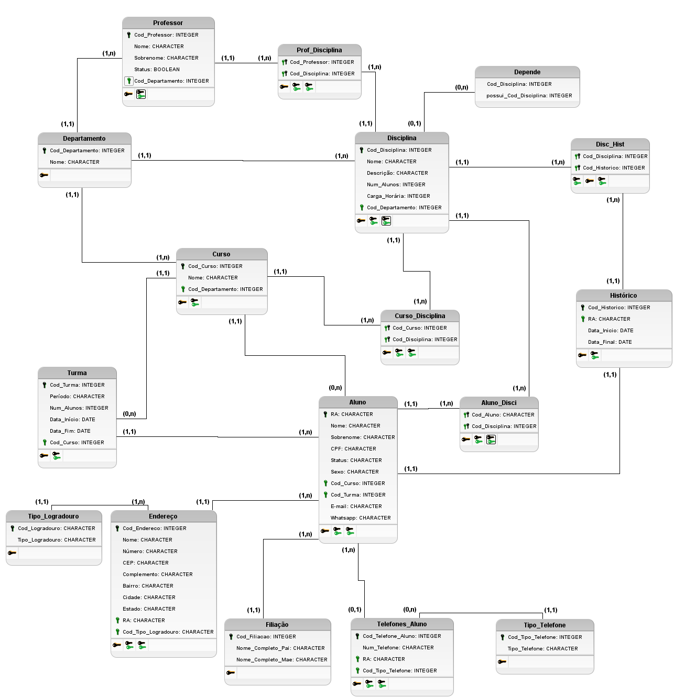

# Estudos Banco de Dados
## **Fonte de Estudos: [Bóson Treinamentos](https://www.youtube.com/playlist?list=PLucm8g_ezqNoNHU8tjVeHmRGBFnjDIlxD)**
### **Tecnologias usadas**
- [brModelo v3.31](http://www.sis4.com/brModelo/index.html) - ferramenta para criação da modelagem do BD, tanto conceitual quanto relacional.

## **Banco de dados para gerenciamento de uma faculdade** 
- controle centralizado de alunos, professores, cursos, disciplinas, histórico escolar e turmas

## **Aula 00 - Criação das entidades** 

## **Aula 01 - Alocando atributos** 

## **Aula 02 - Determinando cardinalidade** 

## **Aula 03 - Eliminando relacionamentos muitos para muitos** 
### **Modelo Conceitual:**

## **Aula 04 - Dicionário de Dados: Atributos** 
**NOTA: Atributos com \* podem ser transformados em entidades**
## **Entidade Professor**
| Atributo | Tipo de dado | Comprimento | Restrições | Descrição |
| - | - | - | - | - |
| <ins>Cod_Professor</ins> | Inteiro | 4 bytes | PK, NOT NULL | Código de identificação do professor |
| Nome | Caractere | 40 bytes | NOT NULL | Nome do professor |
| Sobrenome | Caractere | 40 bytes | NOT NULL | Sobrenome do professor |
| Status | Booleano | 1 bit | NOT NULL | Estado do professor (lecionando/não lecionando) |
| Cod_Departamento | Inteiro | 4 bytes | FK, NOT NULL | Código de identificação do departamento |

## **Entidade Departamento**
| Atributo | Tipo de dado | Comprimento | Restrições | Descrição |
| - | - | - | - | - |
| <ins>Cod_Departamento</ins> | Inteiro | 4 bytes | PK, NOT NULL | Código de identificação do departamento |
| Nome | Caractere | 40 bytes | NOT NULL | Nome do departamento |

## **Entidade Curso**
| Atributo | Tipo de dado | Comprimento | Restrições | Descrição |
| - | - | - | - | - |
| <ins>Cod_Curso</ins> | Inteiro | 4 bytes | PK, NOT NULL | Código de identificação do curso |
| Nome | Caractere | 40 bytes | NOT NULL | Nome do curso |
| Cod_Departamento | Inteiro | 4 bytes | FK, NOT NULL | Código de identificação do curso |

## **Entidade Aluno**
| Atributo | Tipo de dado | Comprimento | Restrições | Descrição |
| - | - | - | - | - |
| <ins>RA</ins> | Caractere | 8 bytes | PK, NOT NULL | Código de identificação do aluno |
| Nome | Caractere | 25 bytes | NOT NULL | Nome do aluno |
| Sobrenome | Caractere | 40 bytes | NOT NULL | Sobrenome do aluno |
| CPF | Caractere | 40 bytes | NOT NULL | CPF do aluno |
| *Telefone | Caractere | 40 bytes | NOT NULL | Telefones do aluno |
| Status | Caractere | 1 byte | NOT NULL | Estado da matrícula do aluno |
| *Contato | Caractere | 40 bytes | NOT NULL | Forma de contato com o aluno |
| Filiação | Caractere | 80 bytes | NOT NULL | Nome da mãe do aluno |
| Sexo | Caractere | 1 byte | NOT NULL | Sexo do aluno |
| Cod_Curso | Inteiro | 4 bytes | FK, NOT NULL | Código de identificação do departamento |
| Cod_Turma | Inteiro | 4 bytes | FK, NOT NULL | Código de identificação do departamento |

## **Entidade Endereço**
| Atributo | Tipo de dado | Comprimento | Restrições | Descrição |
| - | - | - | - | - |
| <ins>Cod_Endereco</ins> | Inteiro | 4 bytes | PK, NOT NULL | Código de identificação do endereço |
| Logradouro | Caractere | 40 bytes | NOT NULL | Rua, avenida, alameda, viela, etc. |
| Nome | Caractere | 80 bytes | NOT NULL | Nome do endereço do aluno |
| Número | Caractere | 10 byte | NOT NULL | Número da casa do aluno |
| CEP | Caractere | 10 byte | NOT NULL | CEP do endereço do aluno |
| Bairro | Caractere | 40 bytes | NOT NULL | Bairro onde o aluno reside |
| Cidade | Caractere | 40 bytes | NOT NULL | Cidade onde o aluno reside |
| Estado | Caractere | 40 bytes | NOT NULL | Estado onde o aluno reside |

## **Entidade Disciplina**
| Atributo | Tipo de dado | Comprimento | Restrições | Descrição |
| - | - | - | - | - |
| <ins>Cod_Disciplina</ins> | Inteiro | 4 bytes | PK, NOT NULL | Código de identificação da disciplina |
| Nome | Caractere | 30 bytes | NOT NULL | Nome da disciplina |
| Descrição | Caractere | 200 bytes | NULL | Descrição da disciplina |
| Num_Alunos | Inteiro | 4 bytes | NOT NULL | Número de alunos na disciplina |
| Carga_Horária  | Inteiro | 4 bytes | NOT NULL | Carga horária total da disciplina |
| Cod_Departamento | Inteiro | 4 bytes | FK, NOT NULL | Código do departamento responsável pela disciplina |

## **Entidade Turma**
| Atributo | Tipo de dado | Comprimento | Restrições | Descrição |
| - | - | - | - | - |
| <ins>Cod_Turma</ins> | Inteiro | 4 bytes | PK, NOT NULL | Código de identificação do turma |
| Período | Caractere | 20 bytes | NOT NULL | Período da turma (manhã, tarde ou noite) |
| Num_Alunos | Inteiro | 4 bytes | NOT NULL | Número de alunos matriculados na turma |
| Data_Início | Data | 4 bytes | NOT NULL | Data de início da turma |
| Data_Fim | Data | 4 bytes | NOT NULL | Data de fim da turma |
| Cod_Curso | Inteiro | 4 bytes | FK, NOT NULL | Código de identificação do curso |

## **Entidade Histórico**
| Atributo | Tipo de dado | Comprimento | Restrições | Descrição |
| - | - | - | - | - |
| <ins>Cod_Historico</ins> | Inteiro | 4 bytes | PK, NOT NULL | Código de identificação do histórico |
| RA | Caractere | 8 bytes | FK, NOT NULL | Código de identificação do aluno |
| Período_Realização | Data | 4 bytes | NOT NULL | Duração de realização da disciplina (em meses) |

# **Entidades Associativas**

## **Entidade Disc_Hist**
| Atributo | Tipo de dado | Comprimento | Restrições | Descrição |
| - | - | - | - | - |
| <ins>Cod_Historico</ins> | Inteiro | 4 bytes | PK, FK, NOT NULL | Código de identificação do histórico |
| <ins>Cod_Disciplina</ins> | Inteiro | 4 bytes | PK, FK, NOT NULL | Código de identificação da disciplina |
| Nota | Decimal | 8 bytes | NOT NULL | Nota da disciplina |
| Frequência | Inteiro | 4 bytes | NOT NULL | Número de faltas na disciplina |

## **Entidade Curso_Disciplina**
| Atributo | Tipo de dado | Comprimento | Restrições | Descrição |
| - | - | - | - | - |
| <ins>Cod_Curso</ins> | Inteiro | 4 bytes | PK, FK, NOT NULL | Código de identificação do curso |
| <ins>Cod_Disciplina</ins> | Inteiro | 4 bytes | PK, FK, NOT NULL | Código de identificação da disciplina |

## **Entidade Prof_Disciplina**
| Atributo | Tipo de dado | Comprimento | Restrições | Descrição |
| - | - | - | - | - |
| <ins>Cod_Professor</ins> | Inteiro | 4 bytes | PK, FK, NOT NULL | Código de identificação do professor |
| <ins>Cod_Disciplina</ins> | Inteiro | 4 bytes | PK, FK, NOT NULL | Código de identificação da disciplina |

## **Entidade Aluno_Disci**
| Atributo | Tipo de dado | Comprimento | Restrições | Descrição |
| - | - | - | - | - |
| <ins>Cod_Aluno</ins> | Caractere | 8 bytes | PK, NOT NULL | Código de identificação do aluno (RA) |
| <ins>Cod_Disciplina</ins> | Inteiro | 4 bytes | PK, FK, NOT NULL | Código de identificação da disciplina |

## **Aula 05 - Derivando modelo lógico** 
### **Modelo Lógico:**

## **Aula 06 - Normalização - Primeira Forma Normal** 
Regras:
- existe chave 1ª
- somente valores atômicos (não multivalorados)
- relação não possui atributos multivalorados ou relações aninhadas
- relação não possui atributos compostos

## **Aula 07 - Normalização - Segunda Forma Normal** 
**Regras:**
- estar na 1ª FN
- todos os atributos não-chave (seja primária ou estrangeira) são funcionalmente dependentes de todas as partes da chave primária
- não existem dependências parciais
- atributos não dependem de chaves candidatas
- caso contrário, deve-se gerar uma nova tabela com os dados

**Alterações após a 2ª FN:**
- Adicionadas as tabelas:
  - Endereço
  - Logradouro
  - Filiação
  - Telefones_Aluno
  - Tipo_Telefon

## **Aula 08 - Normalização - Terceira Forma Normal** 
Regras:
- estar na 2ª FN
- não existirem dependências transitivas
- uma tabela está na 3ª FN se ela estiver na 2ª FN e se nenhuma coluna não-chave depender de outra coluna não-chave
- dependência transitiva é uma dependência funcional entre dois ou mais atributos não-chave.
- caso contrário, deve-se gerar uma nova tabela com os dados

**Como resolver:**
- p/cada atributo (ou grupo) não-chave que for um determinante na relação, crie uma nova tabela
- esse atributo será a PK da relação
- mova então todos os atributos que são dependentes funcionalmente do atributo chave para a nova tabela
- o atributo (PK na nova relação) fica também na tabela original, e servirá como uma chave estrangeira para associar as duas relações

## **Aula 09 - Dicionário de Dados Atualizado: Atributos** 
## **Entidade Departamento**
| Atributo | Tipo de dado | Comprimento | Restrições | Descrição |
| - | - | - | - | - |
| <ins>Cod_Departamento</ins> | Inteiro | 2 bytes | PK, NOT NULL | Código de identificação do departamento |
| Nome | Caractere | 20 bytes | NOT NULL | Nome do departamento |

## **Entidade Professor**
| Atributo | Tipo de dado | Comprimento | Restrições | Descrição |
| - | - | - | - | - |
| <ins>Cod_Professor</ins> | Inteiro | 2 bytes | PK, NOT NULL | Código de identificação do professor |
| Nome | Caractere | 20 bytes | NOT NULL | Nome do professor |
| Sobrenome | Caractere | 50 bytes | NOT NULL | Sobrenome do professor |
| Status | Booleano | 1 bit | NOT NULL | Estado do professor (lecionando/não lecionando) |
| Cod_Departamento | Inteiro | 2 bytes | FK, NOT NULL | Código de identificação do departamento |

## **Entidade Curso**
| Atributo | Tipo de dado | Comprimento | Restrições | Descrição |
| - | - | - | - | - |
| <ins>Cod_Curso</ins> | Inteiro | 2 bytes | PK, NOT NULL | Código de identificação do curso |
| Nome | Caractere | 40 bytes | NOT NULL | Nome do curso |
| Cod_Departamento | Inteiro | 2 bytes | FK, NOT NULL | Código de identificação do curso |

## **Entidade Turma**
| Atributo | Tipo de dado | Comprimento | Restrições | Descrição |
| - | - | - | - | - |
| <ins>Cod_Turma</ins> | Inteiro | 2 bytes | PK, NOT NULL | Código de identificação do turma |
| Período | Caractere | 5 bytes | NOT NULL | Período da turma (manhã, tarde ou noite) |
| Num_Alunos | Inteiro | 2 bytes | NOT NULL | Número de alunos matriculados na turma |
| Data_Início | Data | 4 bytes | NOT NULL | Data de início da turma |
| Data_Fim | Data | 4 bytes | NULL | Data de fim da turma |
| Cod_Curso | Inteiro | 2 bytes | FK, NOT NULL | Código de identificação do curso |

## **Entidade Disciplina**
| Atributo | Tipo de dado | Comprimento | Restrições | Descrição |
| - | - | - | - | - |
| <ins>Cod_Disciplina</ins> | Inteiro | 2 bytes | PK, NOT NULL | Código de identificação da disciplina |
| Nome | Caractere | 30 bytes | NOT NULL | Nome da disciplina |
| Descrição | Caractere | 200 bytes | NULL | Descrição da disciplina |
| Num_Alunos | Inteiro | 2 bytes | NOT NULL | Quantidade de alunos na disciplina |
| Carga_Horária  | Inteiro | 2 bytes | NOT NULL | Carga horária total da disciplina |
| Cod_Departamento | Inteiro | 2 bytes | FK, NOT NULL | Código do departamento responsável pela disciplina |

## **Entidade Prof_Disciplina**
| Atributo | Tipo de dado | Comprimento | Restrições | Descrição |
| - | - | - | - | - |
| <ins>Cod_Professor</ins> | Inteiro | 2 bytes | PK, FK, NOT NULL | Código de identificação do professor |
| <ins>Cod_Disciplina</ins> | Inteiro | 2 bytes | PK, FK, NOT NULL | Código de identificação da disciplina |

## **Entidade Curso_Disciplina**
| Atributo | Tipo de dado | Comprimento | Restrições | Descrição |
| - | - | - | - | - |
| <ins>Cod_Curso</ins> | Inteiro | 2 bytes | PK, FK, NOT NULL | Código de identificação do curso |
| <ins>Cod_Disciplina</ins> | Inteiro | 2 bytes | PK, FK, NOT NULL | Código de identificação da disciplina |

## **Entidade Aluno**
| Atributo | Tipo de dado | Comprimento | Restrições | Descrição |
| - | - | - | - | - |
| <ins>RA</ins> | Inteiro | 4 bytes | PK, NOT NULL | Código de identificação do aluno |
| Nome | Caractere | 20 bytes | NOT NULL | Nome do aluno |
| Sobrenome | Caractere | 50 bytes | NOT NULL | Sobrenome do aluno |
| CPF | Caractere | 11 bytes | NOT NULL, UNIQUE | CPF do aluno |
| Status | Caractere | 1 bit | NOT NULL | Estado da matrícula do aluno |
| E-mail | Caractere | 60 bytes | NOT NULL | E-mail do aluno |
| Whatsapp | Caractere | 11 bytes | NULL | Whatsapp do aluno |
| Sexo | Caractere | 1 byte | NOT NULL | Sexo do aluno |
| Cod_Curso | Inteiro | 2 bytes | FK, NOT NULL | Código de identificação do curso |
| Cod_Turma | Inteiro | 2 bytes | FK, NOT NULL | Código de identificação da turma |

## **Entidade Aluno_Disci**
| Atributo | Tipo de dado | Comprimento | Restrições | Descrição |
| - | - | - | - | - |
| <ins>RA</ins> | Inteiro | 4 bytes | PK, FK, NOT NULL | Código de identificação do aluno (RA) |
| <ins>Cod_Disciplina</ins> | Inteiro | 2 bytes | PK, FK, NOT NULL | Código de identificação da disciplina |

## **Entidade Histórico**
| Atributo | Tipo de dado | Comprimento | Restrições | Descrição |
| - | - | - | - | - |
| <ins>Cod_Historico</ins> | Inteiro | 2 bytes | PK, NOT NULL | Código de identificação do histórico |
| RA | Inteiro | 4 bytes | FK, NOT NULL | Código de identificação do aluno |
| Data_Inicio | Data | 4 bytes | NOT NULL | Data de início do curso |
| Data_Final | Data | 4 bytes | NULL | Data em que o aluno finalizou o curso |

## **Entidade Disc_Hist**
| Atributo | Tipo de dado | Comprimento | Restrições | Descrição |
| - | - | - | - | - |
| <ins>Cod_Historico</ins> | Inteiro | 2 bytes | PK, FK, NOT NULL | Código de identificação do histórico |
| <ins>Cod_Disciplina</ins> | Inteiro | 2 bytes | PK, FK, NOT NULL | Código de identificação da disciplina |
| Nota | Decimal | 8 bytes | NOT NULL | Nota da disciplina |
| Frequência | Inteiro | 2 bytes | NOT NULL | Número de faltas na disciplina |

## **Entidade Tipo_Telefones**
| Atributo | Tipo de dado | Comprimento | Restrições | Descrição |
| - | - | - | - | - |
| <ins>Cod_Tipo_Telefone</ins> | Inteiro | 1 byte | PK, NOT NULL | Código de identificação do tipo de telefone |
| Tipo_Telefone | Caractere | 12 bytes | NOT NULL | Nome do tipo de telefone |

## **Entidade Telefones_Aluno**
| Atributo | Tipo de dado | Comprimento | Restrições | Descrição |
| - | - | - | - | - |
| <ins>Cod_Telefone_Aluno</ins> | Inteiro | 1 byte | PK, NOT NULL | Código de identificação do telefone do aluno |
| Num_Telefone | Caractere | 11 bytes | NOT NULL | Número do telefone |
| RA | Inteiro | 4 bytes | FK, NOT NULL | RA do aluno |
| Cod_Tipo_Telefone | Inteiro | 1 byte | FK, NOT NULL | Código do tipo de telefone |

## **Entidade Tipo_Logradouro**
| Atributo | Tipo de dado | Comprimento | Restrições | Descrição |
| - | - | - | - | - |
| <ins>Cod_Tipo_Logradouro</ins> | Inteiro | 1 byte | PK, NOT NULL | Código de identificação do tipo de logradouro |
| Tipo_Logradouro | Caractere | 10 bytes | NOT NULL | Rua, avenida, alameda, viela, etc. |

## **Entidade Endereço**
| Atributo | Tipo de dado | Comprimento | Restrições | Descrição |
| - | - | - | - | - |
| <ins>Cod_Endereco</ins> | Inteiro | 1 byte | PK, NOT NULL | Código de identificação do endereço do aluno |
| Nome | Caractere | 50 bytes | NOT NULL | Nome da rua do aluno |
| Número | Caractere | 6 bytes | NOT NULL | Número da casa do aluno |
| CEP | Caractere | 8 bytes | NOT NULL | CEP da rua do aluno |
| Complemento | Caractere | 40 bytes | NOT NULL | Rua, avenida, alameda, viela, etc. |
| Bairro | Caractere | 40 bytes | NOT NULL | Bairro onde o aluno reside |
| Cidade | Caractere | 40 bytes | NOT NULL | Cidade onde o aluno reside |
| Estado | Caractere | 40 bytes | NOT NULL | Estado onde o aluno reside |
| RA | Inteiro | 4 bytes | PK, FK, NOT NULL | RA do aluno |
| Cod_Tipo_Logradouro | Inteiro | 1 byte | PK, FK, NOT NULL | Código de identificação do logradouro |

## **Entidade Filiação**
| Atributo | Tipo de dado | Comprimento | Restrições | Descrição |
| - | - | - | - | - |
| <ins>Cod_Filiacao</ins> | Inteiro | 2 bytes | PK, NOT NULL | Código de identificação da filiação |
| Nome_Completo_Mae | Caractere | 80 bytes | NOT NULL | Nome da mãe do aluno |
| Nome_Completo_Pai | Caractere | 80 bytes | NULL | Nome do pai do aluno |
| RA | Inteiro | 4 bytes | FK, NOT NULL | Código de identificação do aluno |

### **Modelo Lógico Completo:**

## **Aula 10 - Implementação do Banco de Dados** 
**NOTA: Diferente do curso, irei criar o BD no PostgreSQL ao invés do MySQL, logo o arquivo.sql será um pouco diferente**
### **Diagrama do Banco de Dados gerado:**
