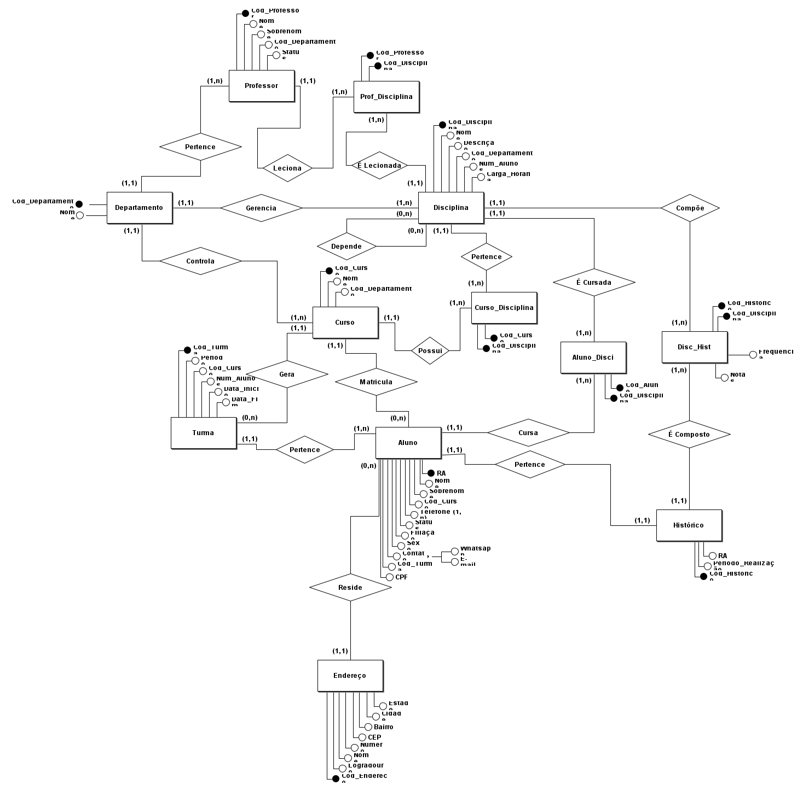

# Estudos Banco de Dados
## **Fonte de Estudos: [Bóson Treinamentos](https://www.youtube.com/playlist?list=PLucm8g_ezqNoNHU8tjVeHmRGBFnjDIlxD)**
### **Tecnologias usadas**
- [brModelo v3.31](http://www.sis4.com/brModelo/index.html) - ferramenta para criação da modelagem do BD, tanto conceitual quanto relacional.

## **Banco de dados para gerenciamento de uma faculdade** 
- controle centralizado de alunos, professores, cursos, disciplinas, histórico escolar e turmas

## **Aula 00 - Criação das entidades** 

## **Aula 01 - Alocando atributos** 

## **Aula 02 - Determinando cardinalidade** 

## **Aula 03 - Eliminando relacionamentos muitos para muitos** 

## **Entidades** 
### **Professor** 
#### **Atributos:** 
- <ins>Cod_Professor</ins>
- Nome
- Sobrenome
- Cod_Departamento
- Status
### **Departamento** 
#### **Atributos:** 
- <ins>Cod_Departamento</ins>
- Nome
### **Curso** 
#### **Atributos:** 
- <ins>Cod_Curso</ins>
- Nome
- Cod_Departamento
### **Aluno** 
#### **Atributos:** 
- <ins>RA</ins>
- Nome
- Sobrenome
- Endereço
- Cod_Curso
- *Telefone
- Status
- Filiação
- Sexo
- *Contato
- Cod_Turma
- CPF
### **Disciplina** 
#### **Atributos:** 
- <ins>Cod_Disciplina</ins>
- Nome
- Descrição
- Cod_Departamento
- Num_Alunos
- Carga_Horária 
### **Turma** 
#### **Atributos:** 
- <ins>Cod_Turma</ins>
- Período
- Cod_Curso
- Num_Alunos
- Data_Início
- Data_Fim
### **Histórico** 
#### **Atributos:** 
- <ins>Cod_Historico</ins>
- Notas
- Média
- Frequência
- Período_Realização
- RA
- Cod_Disciplina